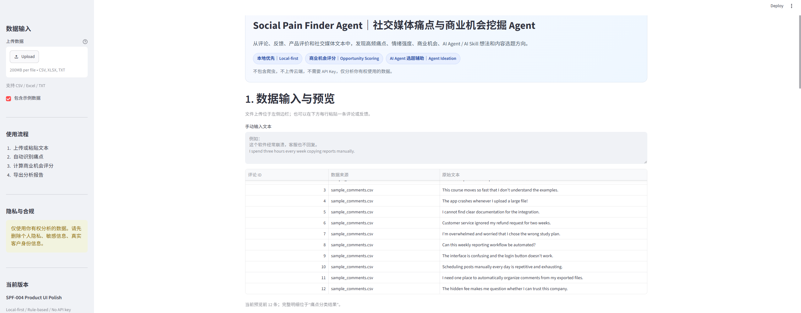
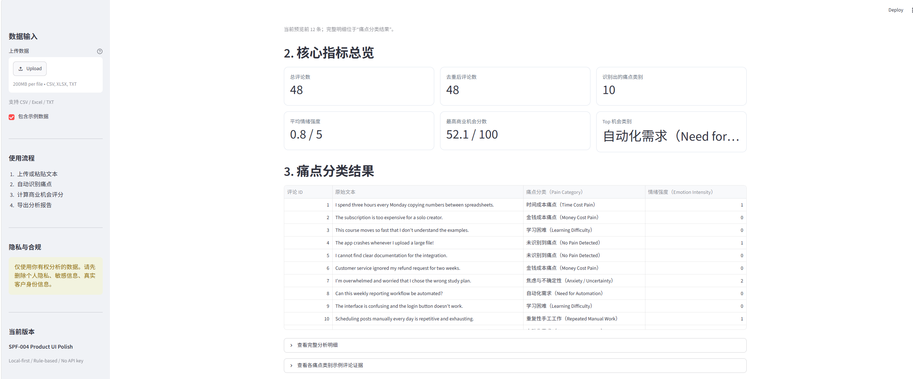
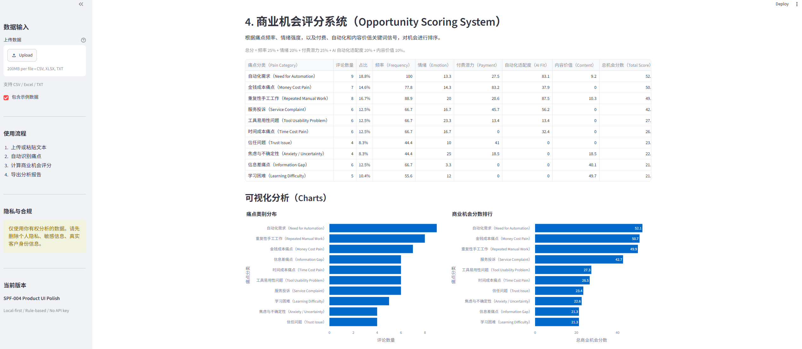
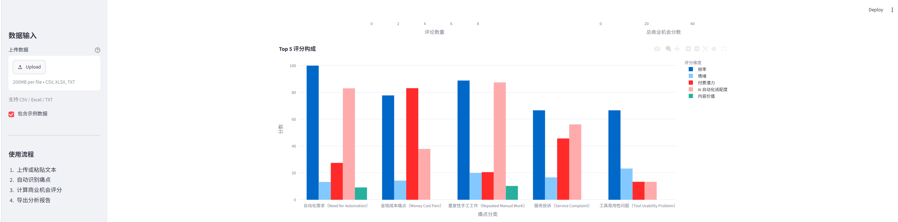
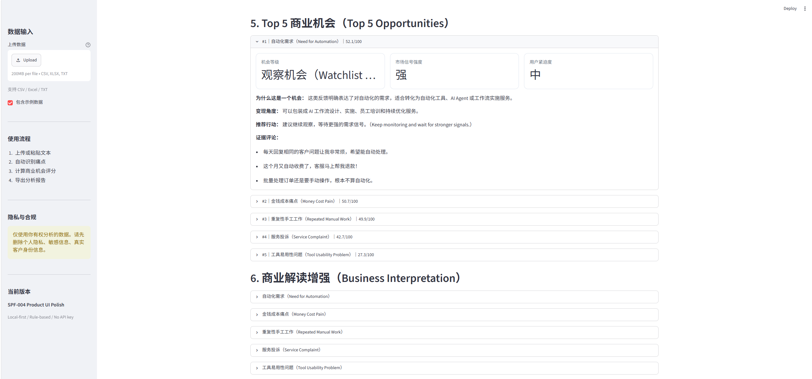
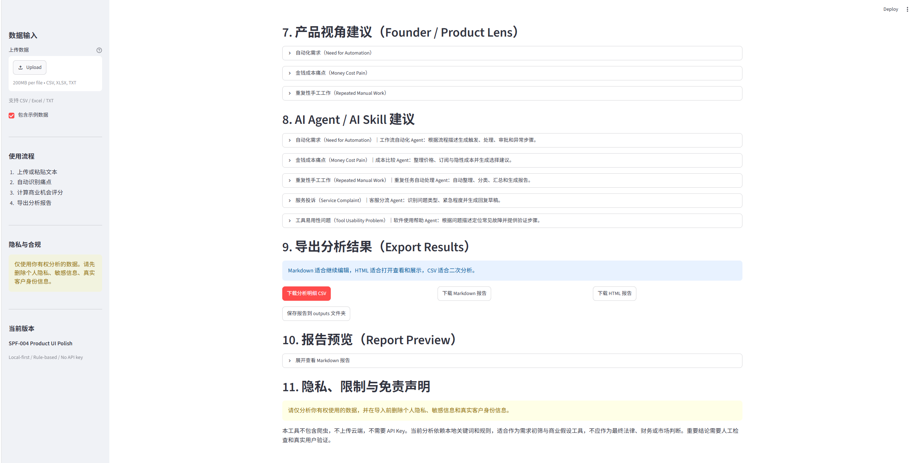
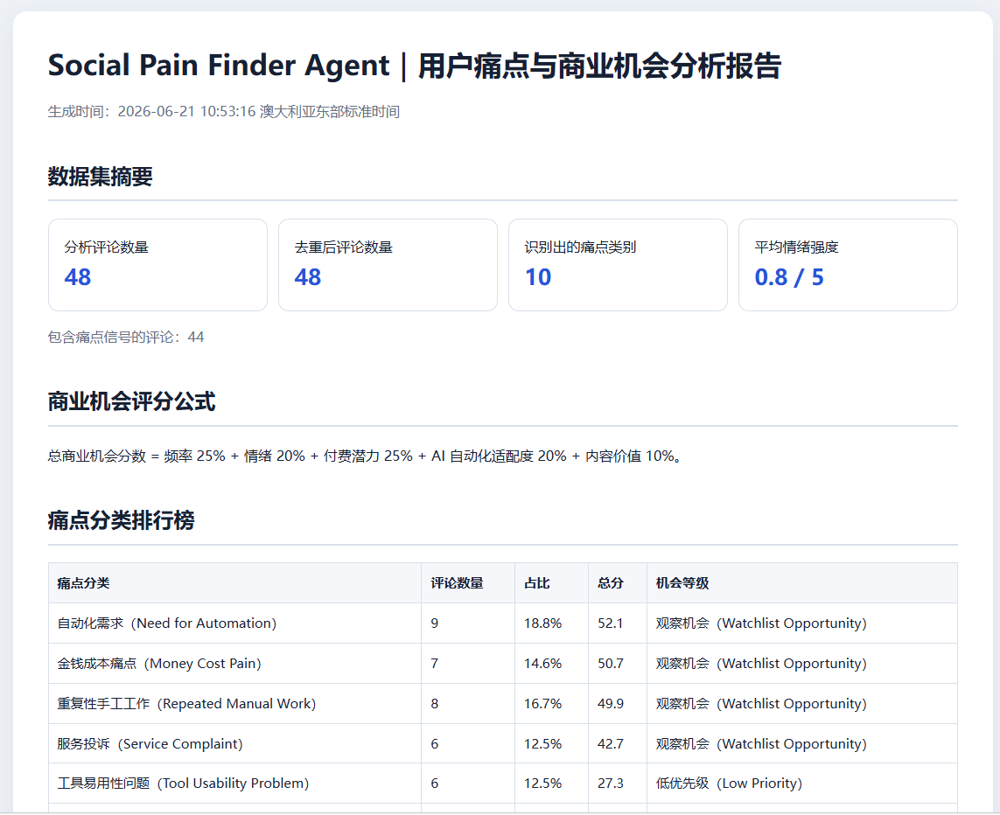

# SocialPainFinderAgent

## 社交媒体痛点与商业机会挖掘 Agent

> A local-first AI workflow for discovering user pain points, business opportunities, AI Agent ideas, automation opportunities, and content topics from comments, reviews, and feedback data.

SocialPainFinderAgent 是一个中文优先、本地运行的 Streamlit 分析工具。这个项目用于分析评论、用户反馈、产品评价和社交媒体文本，自动识别痛点分类、情绪强度、商业机会评分、AI Agent / AI Skill 想法、内容选题方向，并支持 CSV / Markdown / HTML 报告导出。

本项目不包含爬虫，不需要 API Key，也不会将分析数据上传到云端。

## Problem statement

Creators, students, marketers, course teams, and small businesses often collect large amounts of comments and feedback but struggle to turn them into useful decisions. Raw text alone does not clearly show which problems are frequent, urgent, commercially valuable, suitable for automation, or worth turning into content.

SocialPainFinderAgent converts user-provided text into structured pain categories, evidence comments, emotion scores, opportunity rankings, product hypotheses, AI Agent ideas, and content directions. The goal is not to replace research—it is to make the first round of opportunity discovery faster, more consistent, and easier to explain.

## Key features

- CSV, Excel, and TXT file upload
- Manual text input
- Chinese-first bilingual Streamlit UI
- Local rule-based pain-point detection
- English and Chinese keyword dictionaries
- Multi-label comment classification
- Emotion intensity scoring from 0–5
- Business opportunity scoring from 0–100
- Top 5 opportunity ranking and evidence comments
- Business interpretation and monetization angles
- Founder / Product Lens with MVP and user-test suggestions
- AI Agent, AI Skill, and automation workflow ideas
- Short-video, Xiaohongshu, and Douyin topic suggestions
- Comment-level CSV export
- Chinese-first Markdown and standalone HTML reports
- Explicit local saving to the `outputs/` folder
- Local-first privacy and compliance design

## Tech stack

- Python
- Streamlit
- pandas
- Plotly
- openpyxl
- pytest
- Local rule-based NLP logic

No external AI model, cloud database, scraper, or API key is required.

## Project structure

```text
SocialPainFinderAgent/
├── app.py
├── modules/
│   ├── __init__.py
│   ├── data_loader.py
│   ├── text_cleaner.py
│   ├── pain_detector.py
│   ├── scoring.py
│   ├── idea_generator.py
│   ├── report_builder.py
│   └── export_utils.py
├── data/
│   └── sample_comments.csv
├── docs/
│   ├── screenshots/
│   │   ├── 01_home_hero.png
│   │   ├── ...
│   │   └── 07_html_report.png
│   ├── PROJECT_OVERVIEW.md
│   ├── ARCHITECTURE.md
│   ├── PRIVACY_AND_COMPLIANCE.md
│   ├── ROADMAP.md
│   ├── CHANGELOG.md
│   ├── SCREENSHOTS_GUIDE.md
│   └── FINAL_RELEASE_CHECKLIST.md
├── outputs/
│   └── .gitkeep
├── scripts/
│   └── public_release_check.py
├── tests/
│   └── test_basic_pipeline.py
├── PUBLIC_SHOWCASE_MANIFEST.md
├── requirements.txt
├── README.md
└── .gitignore
```

## How to run on Windows

Open Command Prompt:

```bat
cd /d F:\AIProjects\SocialPainFinderAgent
python -m venv .venv
.venv\Scripts\activate
pip install -r requirements.txt
streamlit run app.py
```

PowerShell activation:

```powershell
Set-Location "F:\AIProjects\SocialPainFinderAgent"
python -m venv .venv
.\.venv\Scripts\Activate.ps1
pip install -r requirements.txt
streamlit run app.py
```

Run the test suite:

```powershell
python -m pytest tests -v
```

## Example workflow

1. Upload comments or paste feedback.
2. Clean and deduplicate the text.
3. Detect one or more pain categories per comment.
4. Score frequency, emotion, payment potential, automation fit, and content value.
5. Review the Top 5 opportunities, evidence, and business interpretation.
6. Export the analysis as CSV, Markdown, or standalone HTML.

## Opportunity scoring

Each detected category receives a 0–100 opportunity score:

```text
Total Opportunity Score =
Frequency × 25%
+ Emotion × 20%
+ Payment Potential × 25%
+ AI Automation Fit × 20%
+ Content Value × 10%
```

Scores are transparent rule-based research signals. They are not market-size estimates or revenue forecasts.

## Example use cases

- Marketing and Voice of Customer research
- Social media comment analysis from authorized exports
- Product review and feedback analysis
- Small-business workflow discovery
- AI Agent and AI Skill idea discovery
- Automation-service opportunity research
- Content topic research
- Course-selling and lead-generation research
- Portfolio project demonstration

## Screenshots

The screenshots below use the bundled synthetic sample data. See [docs/SCREENSHOTS_GUIDE.md](docs/SCREENSHOTS_GUIDE.md) for capture and privacy guidance.

### Home / Hero section



### Core metrics and pain categories



### Opportunity scoring system



### Score components chart



### Top 5 business opportunities



### Export and report preview



### Standalone HTML report



## Privacy and compliance

- No web scraper
- No unofficial social media crawling
- No cloud database
- No API key required
- User-uploaded or manually pasted data only
- Synthetic sample data only in the public repository
- Generated output reports excluded from version control
- Users should remove private, sensitive, identifying, or unauthorized data before analysis

Read the complete policy in [docs/PRIVACY_AND_COMPLIANCE.md](docs/PRIVACY_AND_COMPLIANCE.md).

## Documentation

- [Project overview](docs/PROJECT_OVERVIEW.md)
- [Architecture](docs/ARCHITECTURE.md)
- [Privacy and compliance](docs/PRIVACY_AND_COMPLIANCE.md)
- [Roadmap](docs/ROADMAP.md)
- [Changelog](docs/CHANGELOG.md)
- [Screenshot guide](docs/SCREENSHOTS_GUIDE.md)
- [Final release checklist](docs/FINAL_RELEASE_CHECKLIST.md)
- [Public showcase manifest](PUBLIC_SHOWCASE_MANIFEST.md)

## Roadmap

- Expanded multilingual keyword dictionaries
- Optional OpenAI / LLM-enhanced interpretation
- PDF export with stable Chinese font handling
- Additional report templates
- More visualization and comparison options
- Optional local database for private installations
- Optional public deployment demo using synthetic data only

See [docs/ROADMAP.md](docs/ROADMAP.md) for version history and future direction.

## Disclaimer

SocialPainFinderAgent is a research and portfolio project. It is not a replacement for professional market research, legal advice, privacy review, financial analysis, or final business decision-making. Rule-based classifications and scores should be reviewed by a human and validated with authorized, real-world research before action.

## Managed through AgentHubControlCenter

This project is part of my local-first AI Agent portfolio and can be managed through [AgentHubControlCenter](https://github.com/CHENXJC/AgentHubControlCenter), the central command center for agent manifests, safe actions, useful signals, workflow simulations, connector readiness, approval gates, and public-safe reporting.

SocialPainFinderAgent is registered as an opportunity discovery module in AgentHubControlCenter.
