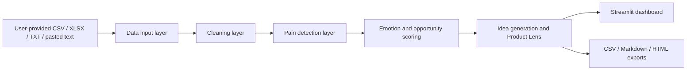

# Architecture

## High-level design

The application uses a modular pipeline. Streamlit coordinates the user experience, while analysis code remains independent enough to test without launching the dashboard.

## Data input layer

**Module:** `modules/data_loader.py`

- Reads `.csv`, `.xlsx`, and `.txt` files.
- Accepts manual text from Streamlit.
- Supports multiple uploads and Excel sheets.
- Looks for common English and Chinese text-column names.
- Standardizes data into `comment_id`, `source`, and `text`.

No network collection or scraping is implemented.

## Cleaning layer

**Module:** `modules/text_cleaner.py`

- Normalizes Unicode and whitespace.
- Removes empty rows.
- Removes duplicate comments using normalized text.
- Preserves both original and cleaned text.
- Keeps English and Chinese content intact.

## Pain detection layer

**Module:** `modules/pain_detector.py`

- Uses visible bilingual keyword dictionaries.
- Supports multiple pain categories per comment.
- Keeps stable English category keys for testing and internal logic.
- Produces a primary category for simple display.

The rules are intentionally inspectable and editable.

## Scoring layer

**Module:** `modules/scoring.py`

- Scores comment emotion intensity from 0–5.
- Aggregates categories and evidence comments.
- Calculates frequency, emotion, payment potential, automation fit, and content value from 0–100.
- Applies the documented weighted total.
- Adds opportunity levels, market-signal strength, urgency, monetization angles, scenarios, and validation guidance.
- Limits weak keyword evidence with an evidence-confidence factor.

The scoring system is a prioritization heuristic, not a predictive model.

## Idea-generation layer

**Module:** `modules/idea_generator.py`

- Maps top categories to Chinese-first AI Agent ideas.
- Suggests AI Skills and workflow automations.
- Generates content-topic, social-post, service, target-user, and next-action ideas.
- Uses deterministic templates so outputs remain local and reproducible.

## Report and export layer

**Modules:** `modules/report_builder.py`, `modules/export_utils.py`

- Orchestrates the full analysis pipeline.
- Builds Markdown and standalone HTML reports.
- Produces Founder / Product Lens recommendations.
- Creates timestamped filenames.
- Writes UTF-8 text and UTF-8-sig CSV files.
- Saves only when the user explicitly clicks the local save button.

Generated files are excluded from version control.

## Streamlit UI layer

**File:** `app.py`

- Provides the Chinese-first product interface.
- Displays input controls, metrics, tables, charts, Top 5 opportunities, ideas, and reports.
- Keeps detailed analysis behind expanders.
- Offers downloads without automatic filesystem writes.
- Uses small embedded CSS only; no CDN or online UI assets are required.

## Why local-first and rule-based for the MVP

The MVP is local-first to reduce privacy exposure, eliminate API-key setup, and make demonstrations reproducible. Rule-based logic makes classifications and scores easy to audit during portfolio reviews. This approach has limitations with nuance, sarcasm, and domain-specific language, so results are framed as initial research signals and not final decisions.

